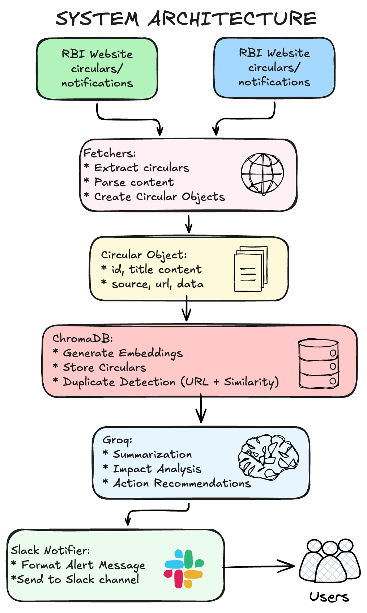
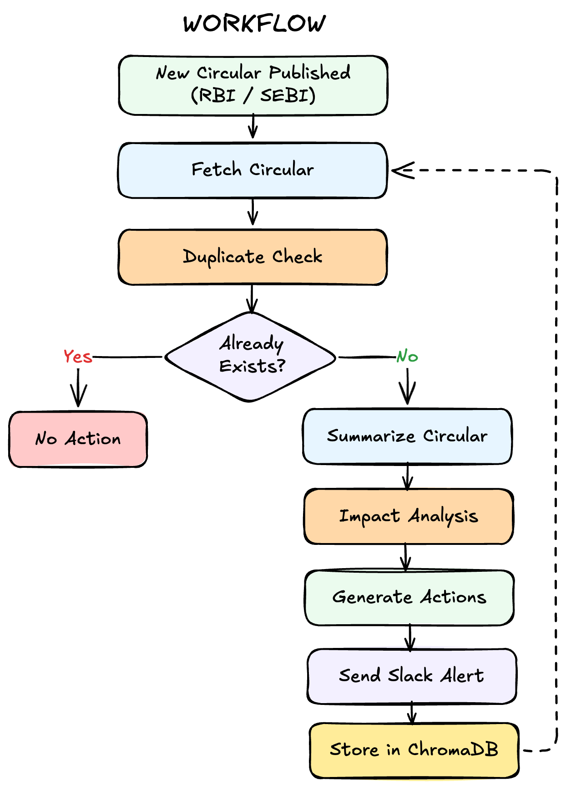
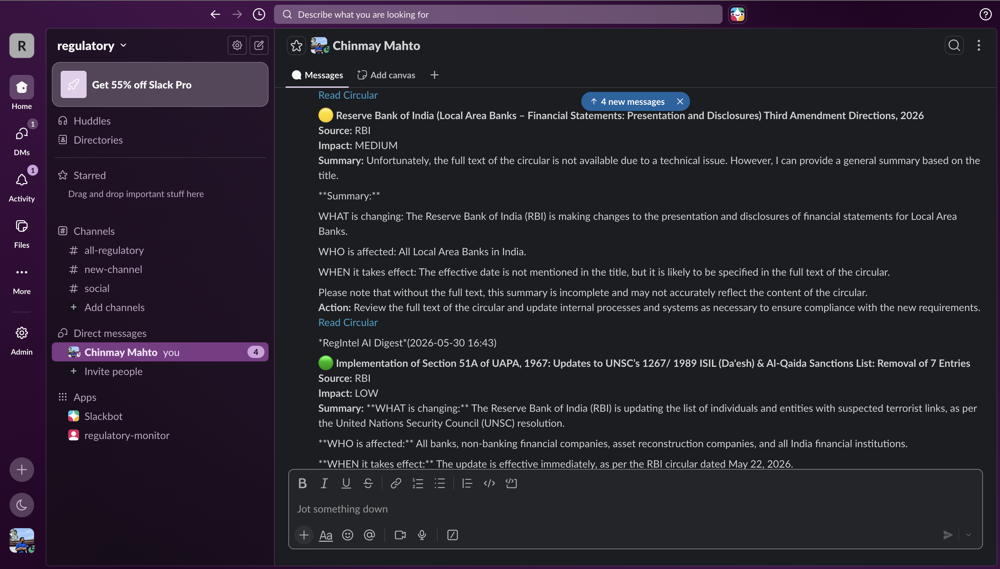

# RegIntel AI

AI powered regulatory monitoring system that automatically tracks RBI and SEBI circulars, identifies new updates, summarizes them using LLMs, scores their business impact, and delivers actionable alerts to Slack.

---

## The Problem:

Regulatory teams, compliance officers, risk teams, and financial institutions face a constant stream of circulars, notifications, and policy updates from regulators such as RBI and SEBI.

The challenges are:

* Regulations are published across multiple sources.
* Teams must manually monitor websites for updates.
* Important circulars can be missed.
* Reading lengthy documents consumes significant time.
* Determining business impact requires domain expertise.
* Different stakeholders need different levels of detail.

As the volume of regulatory updates grows, manual monitoring becomes inefficient and error prone.

---

## Solution

RegIntel AI automates the entire monitoring workflow.

The system:

1. Fetches the latest circulars from RBI and SEBI.
2. Detects whether a circular is new or already processed.
3. Extracts and stores circular content.
4. Uses LLMs to generate concise summaries.
5. Performs impact analysis and recommends actions.
6. Sends digest style notifications to Slack.
7. Runs automatically on a schedule.

This reduces the time required to review regulatory updates from hours to minutes.

---

## Key Features

### Regulatory Monitoring

* RBI circular monitoring
* SEBI circular monitoring
* Automatic content extraction
* Scheduled checks

### Duplicate Detection

* URL based deduplication
* ChromaDB vector storage
* Embedding powered similarity search

### AI Analysis

* Regulatory summarization
* Impact classification
* Affected entity identification
* Recommended actions

### Notifications

* Slack integration
* Automated digest generation

### Automation

* APScheduler based execution
* Fully automated monitoring pipeline

---

## System Architecture

<p align="center">
  
</p>

---

## Project Structure

```text
regulatory-monitor/

├── app/
│   ├── chains/
│   │   ├── summarizer.py
│   │   └── impact_scorer.py
│   │
│   ├── fetchers/
│   │   ├── base.py
│   │   ├── rbi.py
│   │   └── sebi.py
│   │
│   ├── notifier/
│   │   └── slack.py
│   │
│   ├── store/
│   │   └── vector_store.py
│   │
│   ├── scheduler.py
│   └── run_scheduler.py
│
├── tests/
│
├── data/
│
├── requirements.txt
├── .env.example
└── README.md
```

---

## Tech Stack

### Backend

* Python

### AI

* Groq
* Llama 3.1
* LangChain

### Vector Database

* ChromaDB

### Embeddings

* sentence-transformers
* all-MiniLM-L6-v2

### Data Collection

* Requests
* BeautifulSoup

### Scheduling

* APScheduler

### Notifications

* Slack Incoming Webhooks

---

## Example Workflow

<p align="center">
  
</p>

---

## Sample Alert

```text
🔴 Reserve Bank Circular

Source: RBI

Impact: HIGH

Summary:
New governance requirements introduced for regulated entities.

Action Required:
Review compliance procedures and update internal controls.

Read Circular
```

---

## Setup

### Clone Repository

```bash
git clone <repository-url>
cd regulatory-monitor
```

### Create Virtual Environment

```bash
uv venv
source .venv/bin/activate
```

### Install Dependencies

```bash
uv pip install -r requirements.txt
```

### Configure Environment Variables

Create a `.env` file:

```env
GROQ_API_KEY=your_key
SLACK_WEBHOOK_URL=your_webhook
CHROMA_DB_PATH=./data/chroma_db
```

### Run Once

```bash
python -m app.scheduler
```

### Run Continuously

```bash
python -m app.run_scheduler
```

---

## Example Slack Alert



---

## Current Status

### Version 1.0

Implemented:

* RBI monitoring
* SEBI monitoring
* ChromaDB storage
* Duplicate detection
* AI summarization
* Impact scoring
* Slack alerts
* Automated scheduling

---

## Plan for Version 2

### Conversational Regulatory Assistant

Ask questions such as:

* What changed this week?
* Show all RBI updates affecting NBFCs.
* Which circulars require immediate action?

### RAG

* Search historical circulars
* Semantic retrieval
* Source grounded answers

### Voice Agent

* Call based compliance briefing
* Weekly executive summaries
* Interactive voice Q&A

### Email Digests

* Daily digest
* Weekly digest
* Executive reports

### Web Dashboard

* Circular explorer
* Search and filtering
* Trend analysis
* Compliance tracking

---